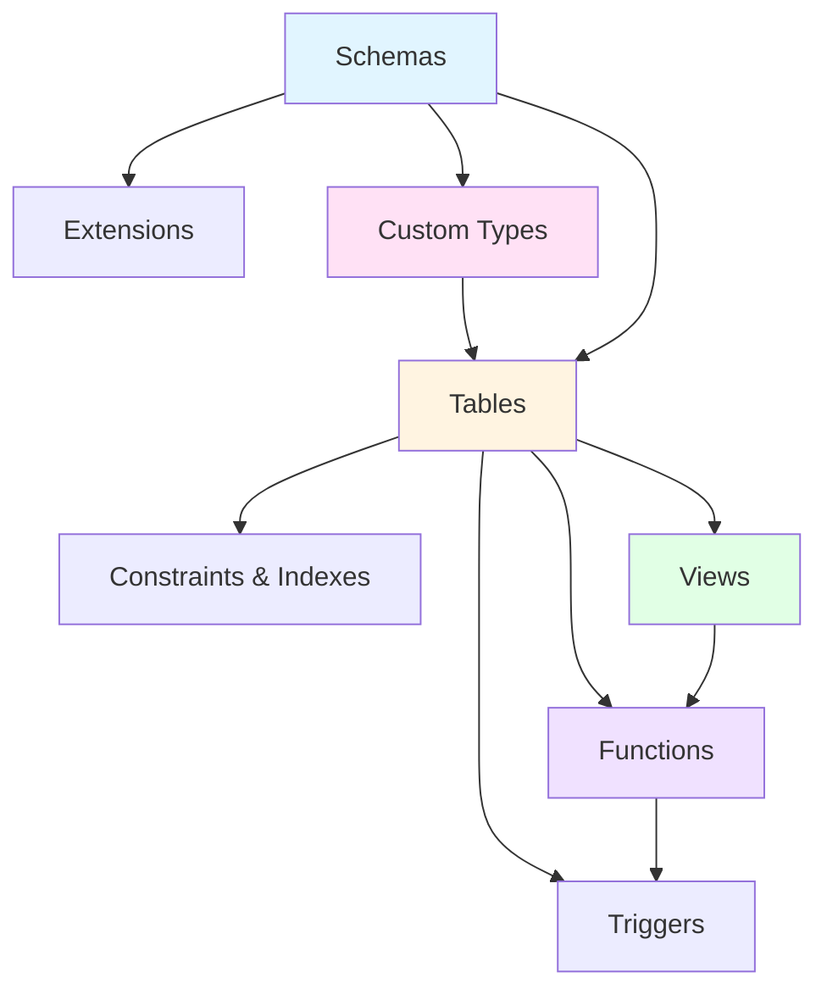

How pgmt ensures database objects are created, modified, and dropped in the correct order.

## Why Dependency Tracking Matters

Database objects often depend on each other. pgmt automatically tracks these dependencies to:

- **Apply changes in the right order** - Create schemas before tables, types before columns
- **Handle drops safely** - Drop views before tables, constraints before columns
- **Prevent circular dependencies** - Detect impossible dependency loops
- **Generate correct migrations** - Ensure production deployments succeed

## Dependency Hierarchy

PostgreSQL enforces a natural hierarchy of database objects:



**Typical creation order:**

1. Schemas (infrastructure)
2. Extensions (capabilities)
3. Custom types (ENUMs, domains)
4. Tables (data structures)
5. Views (queries)
6. Functions (logic)
7. Triggers (behavior)

## How pgmt Tracks Dependencies

pgmt uses three methods to understand dependencies:

### 1. File Organization (Alphabetical)

Files are loaded alphabetically by default:

```
schema/
├── 01_schemas/app.sql          # Loaded first
├── 02_types/status.sql         # Loaded second
├── 03_tables/users.sql         # Loaded third
└── 04_views/active_users.sql  # Loaded last
```

### 2. Explicit Dependencies (`-- require:`)

Declare dependencies in your SQL files:

```sql
-- require: 01_schemas/app.sql, 02_types/user_status.sql
CREATE TABLE app.users (
    id SERIAL PRIMARY KEY,
    status app.user_status DEFAULT 'active'
);
```

### 3. Automatic Detection

pgmt automatically detects:

- **Schema references**: `app.users` depends on `app` schema
- **Type usage**: Columns using custom types depend on those types
- **Array types**: `priority[]` depends on `priority` type
- **Foreign keys**: Tables with FKs depend on referenced tables

## Common Dependency Patterns

### Basic Hierarchy

```sql
-- 1. Schemas created first
CREATE SCHEMA app;

-- 2. Types created second
CREATE TYPE app.user_status AS ENUM ('active', 'inactive');

-- 3. Tables created third
CREATE TABLE app.users (
    id SERIAL PRIMARY KEY,
    status app.user_status DEFAULT 'active'
);

-- 4. Views created last
CREATE VIEW app.active_users AS
SELECT * FROM app.users WHERE status = 'active';
```

### Multiple Dependencies

```sql
-- require: schemas/app.sql, types/order_status.sql, tables/users.sql
CREATE TABLE app.orders (
    id SERIAL PRIMARY KEY,
    user_id INTEGER REFERENCES app.users(id),
    status app.order_status DEFAULT 'pending'
);
```

This table depends on:

- The `app` schema (schema reference)
- The `order_status` type (column type)
- The `users` table (foreign key)

## Organizing Files

You can organize your schema files however you want. Two common approaches:

**Numbered prefixes** leverage alphabetical loading:

```
schema/
├── 01_schemas/app.sql
├── 02_types/enums.sql
├── 03_tables/users.sql
├── 04_views/analytics.sql
```

Files load in order, dependencies are implicit.

**Explicit dependencies** with `-- require:` comments:

```sql
-- require: schemas/app.sql, types/user_status.sql, tables/users.sql
CREATE VIEW app.user_dashboard AS
SELECT u.id, u.email, u.status::text as status_display
FROM app.users u;
```

File organization is flexible, dependencies are explicit.

Many projects use a mix: numbered prefixes for broad categories, `-- require:` for specific dependencies within categories.

## Circular Dependencies

Your schema must be a directed acyclic graph (DAG) - no circular dependencies. If view A depends on view B which depends on view A, pgmt will detect the cycle and fail. The fix is to merge files or restructure to break the cycle.

## Troubleshooting Dependencies

If `pgmt baseline create` or `pgmt migrate new` fails with dependency errors, use the debug command:

```bash
# View full dependency graph
pgmt debug dependencies

# Check a specific object
pgmt debug dependencies --object public.orders

# Human-readable format
pgmt debug dependencies --format text
```

**Common issues:**

- **Missing `-- require:` headers** - A file uses an object defined in another file that loads later alphabetically. Add explicit dependencies.
- **Circular dependencies** - Restructure to break the cycle, or merge the interdependent objects into one file.
- **Wrong file ordering** - Numbered prefixes (01*, 02*) should match the dependency order.

## How pgmt Uses Dependencies

### During `pgmt apply`

1. **Load schema files** in dependency order
2. **Build shadow database** with properly ordered objects
3. **Compare** to dev database
4. **Generate migration steps** respecting dependencies

### During `pgmt migrate new`

1. **Analyze** differences between catalogs
2. **Order CREATE operations** forward (dependencies first)
3. **Order DROP operations** reverse (dependents first)
4. **Handle ALTER operations** considering dependencies

### Example Migration Output

```sql
-- Migration respects dependencies automatically
CREATE SCHEMA app;
CREATE TYPE app.status AS ENUM ('active', 'inactive');
CREATE TABLE app.users (
    id SERIAL PRIMARY KEY,
    status app.status DEFAULT 'active'
);
CREATE VIEW app.active_users AS
    SELECT * FROM app.users WHERE status = 'active';
```

No manual ordering needed - pgmt handles it automatically.

---

**Related Concepts:**

- [How pgmt Works](how-it-works) - The complete workflow
- [Schema Organization](../guides/schema-organization) - Advanced patterns and multi-file strategies
- [Shadow Database](shadow-database) - How dependency rules are validated
