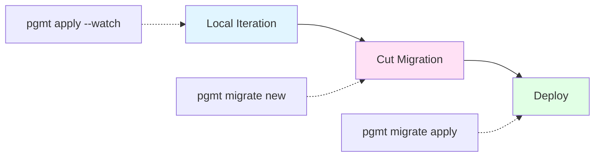
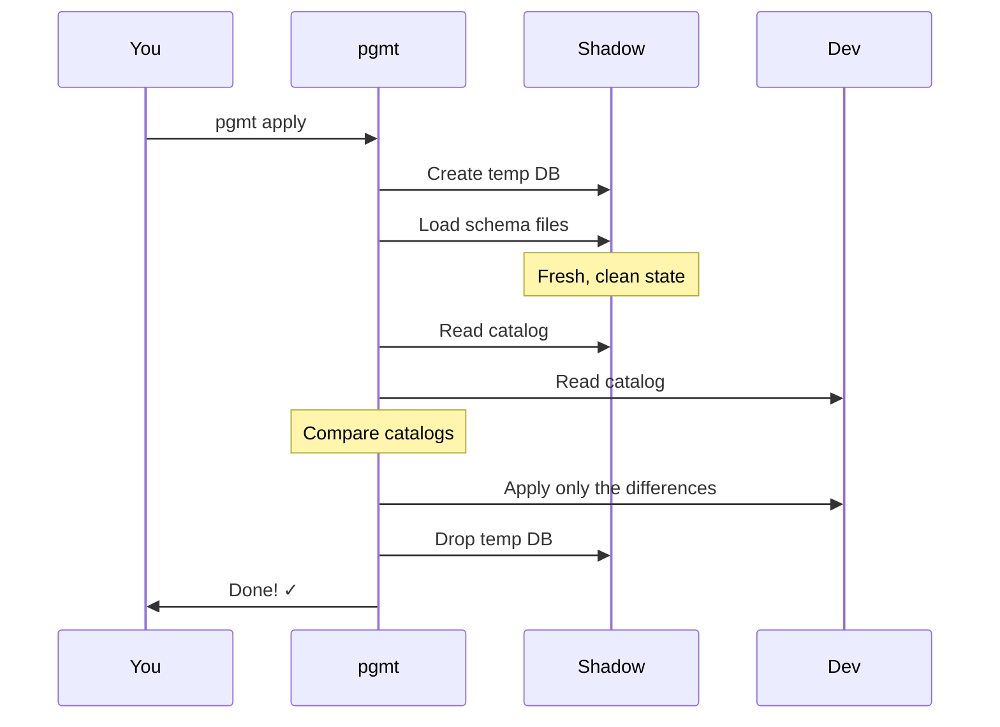

This page explains pgmt's development workflow and how the core commands work internally. You'll see how local iteration with `pgmt apply` differs from generating production migrations with `pgmt migrate new`, and understand the diff engine that powers both. We'll also cover how pgmt handles edge cases like merge conflicts and multi-section migrations.

## The Development Workflow

pgmt's workflow has three phases:



**1. Local Iteration** - Edit schema files, run `pgmt apply` (or `pgmt apply --watch`) to see changes instantly in your dev database. Iterate quickly without creating migrations.

**2. Cut Migration** - When ready to commit, run `pgmt migrate new` to generate a migration file capturing your changes. Review the SQL, edit if needed.

**3. Deploy** - Run `pgmt migrate apply` to apply migrations to staging/production. Migrations are explicit and reviewable before they run.

Now let's see how each phase works internally.

## During Development: Fast Local Iteration

`pgmt apply` takes your schema files and applies them to a target database (usually your local dev database). It figures out what changed and runs the necessary SQL.



The key insight: pgmt diffs the shadow database (what your schema files define) against your dev database (what currently exists), then applies only the differences.

## Getting Ready to Ship: Cutting a Migration

`pgmt migrate new` generates a migration file that captures your schema changes. You run this when you're ready to commit your work and create a migration that can be applied to other environments.

**Where does the "current state" come from?**

For `pgmt apply`, it's simple - read your dev database catalog.

For `pgmt migrate new`, there's no target database specified. Instead, pgmt reconstructs the current state:

1. **Reconstruct current state** - Create a temporary database and apply:
   - The latest baseline (if one exists), then
   - All migrations after that baseline
   - This represents "current production state"

2. **Build desired state** - Apply your schema files to a shadow database (this represents "desired state")

3. **Diff** - Compare the two catalogs

4. **Generate migration** - Write the diff as a new migration file

This is why you can `git clone` a pgmt project and run `pgmt migrate new` without any database set up - pgmt reconstructs the state from baselines and migration history.

**Baselines:** Over time, you might accumulate hundreds of migrations. You can run `pgmt baseline create` to snapshot the current state and clean up old migrations. See the [Baseline Management](../guides/baseline-management) guide.

**Merge conflicts:** If you rebase and someone else changed the same view, you'll have a git conflict in your schema files. Resolve the conflict, then run `pgmt migrate new` again to regenerate the migration.

## Going to Production: Deploying Changes

`pgmt migrate apply` runs migrations against a target database (usually staging or production). It tracks which migrations have been applied and only runs new ones.

**Migration tracking table:** pgmt creates a `pgmt_migrations` table in your database to track:

- Which migrations have been applied
- When they were applied
- Their checksums (to detect modifications)

**The process:**

1. **Check current state** - Query `pgmt_migrations` to see which migrations have already been applied
2. **Find pending migrations** - Identify migrations that exist in `migrations/` but aren't in the tracking table
3. **Validate** - Ensure no applied migrations were modified (checksum mismatch would error)
4. **Apply in order** - Run pending migrations one at a time, in version order
5. **Record** - Insert each migration into `pgmt_migrations` after successful application

**Multi-section migrations:** You can split a migration into execution phases using `-- pgmt:section` comments. Each section has its own configuration for transaction mode, timeout, and retry logic.

Why use sections?

- **Lock management** - Run `CREATE INDEX CONCURRENTLY` with short lock timeouts and automatic retry
- **Transaction boundaries** - Mix transactional and non-transactional operations in one migration
- **Retry logic** - If a section fails (like lock timeout), pgmt retries only that section
- **Progress tracking** - See which sections completed, resume from failures

Example:

```sql
-- pgmt:section name="add_column" mode="transactional" timeout="30s"
ALTER TABLE users ADD COLUMN status TEXT DEFAULT 'active';

-- pgmt:section name="create_index" mode="non-transactional" timeout="2s" retry_attempts="10"
CREATE INDEX CONCURRENTLY idx_users_status ON users(status);
```

Sections execute sequentially. If the index creation fails due to lock timeout, pgmt retries just that section (up to 10 attempts). See [Multi-Section Migrations](../guides/multi-section-migrations) for details.

## Under the Hood: The Diff Engine

At the core of both `pgmt apply` and `pgmt migrate new` is the diff engine - the component that compares two PostgreSQL databases and figures out what SQL is needed to transform one into the other.

**What it compares:**

- Tables and columns (using `pg_class`, `pg_attribute`)
- Indexes (using `pg_index`, `pg_get_indexdef()`)
- Views (using `pg_views`, `pg_get_viewdef()`)
- Functions (using `pg_proc`, `pg_get_functiondef()`)
- Types, triggers, constraints, grants, extensions, etc.

**How it detects changes:**

- Added object: exists in shadow DB, not in target → generate CREATE
- Removed object: exists in target, not in shadow DB → generate DROP
- Modified object: exists in both but definitions differ → generate ALTER or DROP/CREATE

**Dependency ordering:**

- Uses [dependency tracking](dependency-tracking) to ensure operations happen in the right order
- CREATEs happen dependencies-first (schemas → tables → views)
- DROPs happen dependents-first (views → tables → schemas)

---

**Related Concepts:**

- [Philosophy](philosophy) - Why pgmt takes this approach
- [Shadow Database](shadow-database) - Deep dive into shadow DB concept
- [Dependency Tracking](dependency-tracking) - How pgmt orders operations
